<div align="center">

# ☁️ Cloud Cost Optimizer

### AI-Powered Multi-Cloud Cost Analysis & Optimization Platform

[](https://www.python.org/)
[](LICENSE)
[](https://huggingface.co/meta-llama)
[](https://huggingface.co/)

**An intelligent CLI tool that transforms plain-English project descriptions into actionable cloud cost optimization strategies using advanced LLMs.**

[Features](#-features) • [Quick Start](#-quick-start) • [Usage](#-usage) • [Documentation](#-documentation)

</div>

---

## 🎯 Overview

Cloud Cost Optimizer is an academic project demonstrating proficiency in **backend development**, **LLM integration**, and **cloud cost analysis**. It leverages Large Language Models to analyze project requirements, generate realistic synthetic billing data, and provide multi-cloud optimization recommendations.

### 🎬 How It Works

```mermaid
graph LR
    A[📝 Project Description] --> B[🤖 LLM Analysis]
    B --> C[📊 Profile Extraction]
    C --> D[💰 Billing Generation]
    D --> E[📈 Cost Analysis]
    E --> F[✨ Recommendations]
```



---

## ✨ Features

<table>
<tr>
<td width="50%">

### 🧠 **AI-Powered Analysis**
- Natural language project understanding
- Structured JSON profile extraction
- Budget-aware cost modeling

</td>
<td width="50%">

### 📊 **Comprehensive Reporting**
- Multi-cloud billing simulation
- Service-wise cost breakdown
- Budget variance detection

</td>
</tr>
<tr>
<td width="50%">

### 🎯 **Smart Optimization**
- Actionable recommendations
- Cross-cloud cost comparisons
- Resource right-sizing suggestions

</td>
<td width="50%">

### 🖥️ **Developer-Friendly**
- Menu-driven CLI interface
- Strict JSON validation
- Windows-compatible

</td>
</tr>
</table>

---

## 🚀 Quick Start

### Prerequisites

- 🐍 Python 3.10 or higher
- 🔑 Hugging Face API key ([Get one here](https://huggingface.co/settings/tokens))

### Installation

```bash
# Clone the repository
git clone <your-repo-url>
cd cloud_cost_optimizer

# Install dependencies
pip install -r requirements.txt

# Configure environment
cp .env.example .env
# Edit .env and add your HF_API_KEY
```

### ⚙️ Configuration

Create a `.env` file in the project root:

```env
HF_API_KEY=your_huggingface_api_key_here
HF_MODEL=meta-llama/Meta-Llama-3-8B-Instruct
```

> ⚠️ **Security Note:** Never commit your `.env` file! It's already in `.gitignore`.

---

## 🎮 Usage

### Running the Application

**Recommended method:**
```bash
python run.py
```

**Alternative method:**
```bash
python -m src.cli
```

### 📋 CLI Menu Options

```
╔════════════════════════════════════════╗
║   Cloud Cost Optimizer - Main Menu    ║
╚════════════════════════════════════════╝

1️⃣  Provide Project Description
2️⃣  Run Complete Cost Analysis
3️⃣  View Recommendations
4️⃣  Exit

Select an option:
```

### 🔄 Workflow

<details>
<summary><b>Step 1: Project Description Input</b></summary>

Provide a free-form description of your cloud project:

```
Example: "We're building an e-commerce platform that handles 
50,000 daily users. We need a scalable database, CDN for static 
assets, and microservices architecture. Monthly budget: $5,000."
```

**Output:** `data/project_description.txt`

</details>

<details>
<summary><b>Step 2: AI Profile Extraction</b></summary>

The LLM analyzes your description and extracts:
- 📌 Project name
- 💵 Monthly budget
- 🛠️ Tech stack requirements
- 📋 Non-functional requirements

**Output:** `data/project_profile.json`

</details>

<details>
<summary><b>Step 3: Synthetic Billing Generation</b></summary>

Generates 12-20 realistic billing records covering:
- 💻 Compute (EC2, VMs, Containers)
- 🗄️ Database (RDS, Cosmos DB, Cloud SQL)
- 📦 Storage (S3, Blob Storage, Cloud Storage)
- 🌐 Networking (Load Balancers, CDN, VPN)
- 📊 Monitoring & Logs

**Output:** `data/mock_billing.json`

</details>

<details>
<summary><b>Step 4: Cost Analysis & Optimization</b></summary>

Calculates:
- 📊 Total monthly cost
- 📈 Budget variance
- 🔍 Service-wise breakdown
- 💡 Multi-cloud optimization strategies

**Output:** `data/cost_optimization_report.json`

</details>

---

## 📁 Project Structure

```
cloud_cost_optimizer/
│
├── 📂 src/                          # Application source code
│   ├── main.py                      # Main application entry
│   ├── cli.py                       # Command-line interface
│   ├── llm_client.py                # LLM API wrapper
│   ├── profile_extractor.py         # Project analysis module
│   ├── bill_generator.py            # Billing data generator
│   ├── cost_analyzer.py             # Cost calculation engine
│   ├── cost_optimizer.py            # Optimization engine
│   └── report_builder.py            # Report generation
│
├── 📂 data/                         # Data artifacts
│   ├── project_description.txt      # User input
│   ├── project_profile.json         # Extracted profile
│   ├── mock_billing.json            # Generated bills
│   └── cost_optimization_report.json # Final report
│
├── run.py                           # Quick-start runner
├── requirements.txt                 # Python dependencies
├── .env                             # Environment config (not in repo)
├── .gitignore                       # Git ignore rules
└── README.md                        # This file
```

---

## 🛠️ Tech Stack

<div align="center">

| Component | Technology |
|-----------|-----------|
| 🐍 **Language** | Python 3.10+ |
| 🤖 **LLM Provider** | Hugging Face Inference API |
| 🧠 **Model** | Meta-Llama-3-8B-Instruct |
| 💻 **Interface** | Menu-driven CLI |
| ✅ **Validation** | Strict JSON validation |
| 🔧 **Config Management** | python-dotenv |

</div>

---

## 📊 Sample Output

### Project Profile
```json
{
  "project_name": "E-Commerce Platform",
  "monthly_budget": 5000,
  "tech_stack": ["React", "Node.js", "PostgreSQL", "Redis"],
  "requirements": ["High availability", "Auto-scaling", "CDN"]
}
```

### Cost Optimization Report
```json
{
  "total_cost": 4750,
  "budget_variance": -250,
  "recommendations": [
    {
      "service": "compute",
      "current_cost": 2000,
      "savings_potential": 400,
      "recommendation": "Switch to reserved instances"
    }
  ]
}
```

---

## 🤖 AI Usage Disclosure

This project uses **Large Language Models** via the Hugging Face Inference API for:

- 🔍 Project profile extraction from natural language
- 💰 Synthetic billing data generation
- 💡 Cost optimization recommendation generation

All AI-generated outputs undergo **strict JSON validation**. The developer fully understands and owns all submitted code.

---

## ⚠️ Known Limitations

- 🧪 Uses synthetic billing data (not connected to real cloud APIs)
- ⏱️ Free-tier LLM rate limits may introduce latency
- 🎯 Recommendations are educational, not production-grade

---

## 🔮 Future Enhancements

- [ ] 📄 HTML report export with charts
- [ ] ☁️ Azure and GCP-specific billing formats
- [ ] 📊 Interactive cost visualization dashboard
- [ ] 🔌 Real cloud billing API integration (AWS Cost Explorer, Azure Cost Management)
- [ ] 🎨 Web-based UI with React frontend
- [ ] 📧 Email report delivery
- [ ] 🔔 Budget alert notifications

---

## 🤝 Contributing

Contributions are welcome! Here's how you can help:

1. 🍴 Fork the repository
2. 🌿 Create a feature branch (`git checkout -b feature/AmazingFeature`)
3. 💬 Commit your changes (`git commit -m 'Add some AmazingFeature'`)
4. 📤 Push to the branch (`git push origin feature/AmazingFeature`)
5. 🎉 Open a Pull Request

---

## 📝 License

This project is licensed under the **MIT License** - see the [LICENSE](LICENSE) file for details.

---

## 🙏 Acknowledgments

- 🤗 Hugging Face for providing LLM inference infrastructure
- 🦙 Meta AI for the Llama 3 model
- 🎓 Academic institution for project guidance

---

<div align="center">

**Made with ❤️ for Cloud Cost Optimization**

⭐ Star this repo if you find it helpful!

[Report Bug](https://github.com/yourusername/cloud-cost-optimizer/issues) • [Request Feature](https://github.com/yourusername/cloud-cost-optimizer/issues)

</div>
